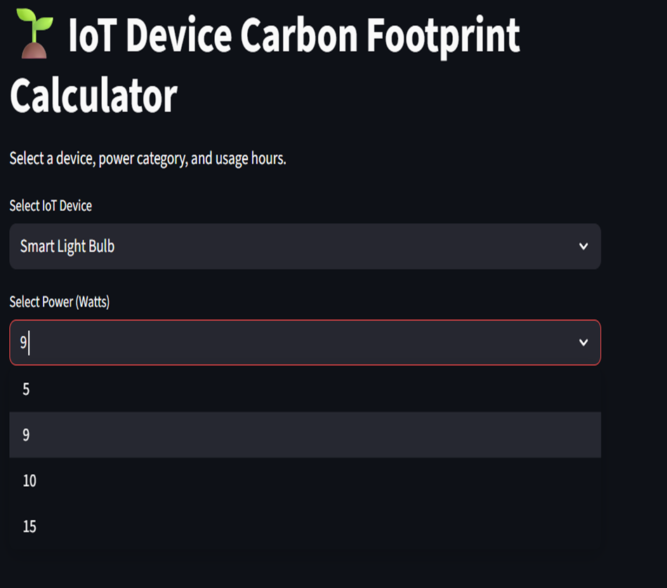
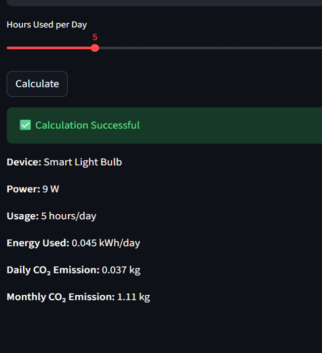
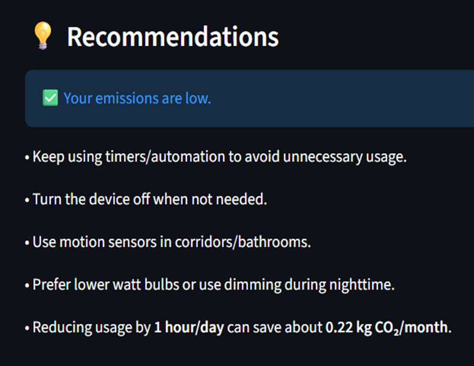

# Corbon Footprint Monitoring
IOT- Based Corbon Footprint Monitoring

A simple Streamlit web application that calculates the daily and monthly CO₂ emissions of common IoT household devices and provides smart, actionable recommendations to reduce carbon footprint.

Features
Devices: Smart Bulb, Fan, Refrigerator
Calculates energy use and CO₂ emissions
Emission level: Low / Medium / High
Device-specific tips and savings insight

Tech Stack
Python
Streamlit

Run the App
Navigate to the project folder and run:
streamlit run app.py

